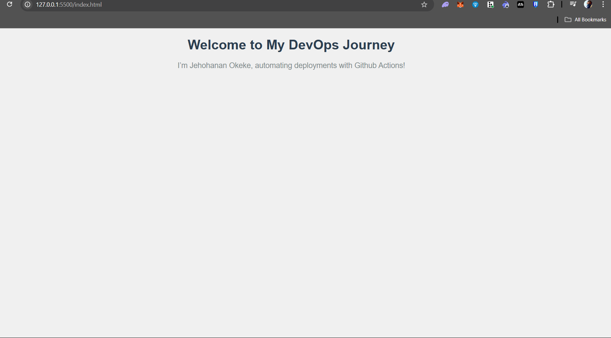

# My Static Website with CI/CD

A simple static website deployed to AWS S3 with automated deployment using GitHub Actions.

## Overview

This project demonstrates my skills in cloud infrastructure and CI/CD pipelines, built as part of my preparation for a DevOps Intern role. The website is a single-page HTML/CSS site showcasing my DevOps journey, hosted on AWS S3. I set up a GitHub Actions workflow to automate deployment, ensuring that any changes pushed to the `main` branch are automatically synced to S3.

- **Website**: A basic HTML/CSS page showcasing my DevOps journey.
- **Deployment**: Hosted on AWS S3 as a static website.
- **CI/CD**: GitHub Actions automates deployment on every push to the `main` branch.

## How It Works

1. Files (`index.html`, `styles.css`) are stored in this repository.
2. A GitHub Actions workflow (`deploy.yml`) syncs files to an S3 bucket (`jehohan-static-website`) using the `aws s3 sync` command.
3. The website is live at: [http://jehohan-static-website.s3-website-eu-north-1.amazonaws.com](http://jehohan-static-website.s3-website-eu-north-1.amazonaws.com).

## Setup Details

- **AWS S3**: Configured the S3 bucket for static website hosting with public read access for `s3:GetObject`.
- **IAM**: Created an IAM user (`github-actions-s3-deployer`) with permissions for `s3:PutObject`, `s3:DeleteObject`, and `s3:ListBucket`, ensuring secure programmatic access.
- **GitHub Actions**: Used `aws-actions/configure-aws-credentials@v3` to authenticate with AWS and automate deployment.

## Screenshots

## Challenges and Learnings

- **Challenge**: Encountered an `AccessDenied` error due to a bucket name mismatch in the IAM policy and `deploy.yml`. Fixed by updating the bucket name to `jehohan-static-website` and ensuring the IAM policy matched.
- **Learning**: Gained hands-on experience with CI/CD pipelines, AWS S3 configuration, IAM permissions, and troubleshooting deployment issues—key skills for a DevOps role.

## About Me

I’m Jehohanan Okeke, a Computer Engineering student at the University of Lagos, passionate about cloud technologies and DevOps. This project is part of my preparation for a DevOps Intern position with a cloud infrastructure company collaborating with Nithub.
